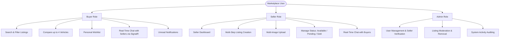

# 🚗 Vehicle-Hub (AutoHub) — Master Implementation & Task Plan

> **University Team Project Implementation Guide & Task Allocation Document**  
> **Backend Architecture**: C# / ASP.NET Core (.NET 8.0) Web API + SignalR  
> **Frontend Architecture**: Next.js 14+ (App Router) + React 18 + Tailwind CSS  
> **Database**: Supabase (PostgreSQL) + Local Storage Fallback  
> **CI/CD**: GitHub Actions Automated Build & Release Pipelines  
> **Collaboration Model**: 4 Team Members on dedicated Git Feature Branches

---

## 1. Project Overview

**Vehicle-Hub (AutoHub)** is a full-stack vehicle marketplace web application designed for buying, selling, comparing, and discussing vehicles in real-time. It features a robust **C# ASP.NET Core (.NET 8.0) Web API** backend, **SignalR** WebSocket communication, **Next.js 14+** frontend, and **Supabase (PostgreSQL)** database backing.

### 1.1 Target Users & Core Capabilities



---

## 2. Technology Stack

| Layer | Technology | Version | Purpose |
| :--- | :--- | :--- | :--- |
| **Backend Language** | C# | `12` | Strongly-typed, high performance backend logic |
| **Backend Framework**| ASP.NET Core Web API | `.NET 8.0` | REST API routes, Dependency Injection, Swagger OpenAPI |
| **Real-Time WebSockets**| Microsoft.AspNetCore.SignalR | `8.0` | Real-time chat, typing indicators, live notifications |
| **Authentication** | JWT Bearer (`JwtBearerDefaults`) + `BCrypt.Net-Next` | Latest | Stateless auth, secure password hashing |
| **Frontend Framework** | Next.js (App Router) | `14+` | App router, layouts, server & client components |
| **Frontend Library** | React | `18+` | UI state, hooks, context state management |
| **Styling** | Tailwind CSS | `3+` | Responsive utility design system |
| **Database** | Supabase (PostgreSQL) | Latest | Cloud relational database with local storage fallback |
| **CI/CD Automation** | GitHub Actions | Latest | Automated testing, compilation, and release packaging |

---

## 3. Repository Directory Structure

```text
Vehicle-Hub/
├── .github/
│   └── workflows/
│       ├── ci.yml                        # GitHub Actions CI Workflow (.NET 8 + Next.js)
│       └── cd.yml                        # GitHub Actions CD Release Workflow
│
├── client/                               # Next.js 14+ Frontend Application
│   ├── app/                              # App Router Pages
│   │   ├── (auth)/
│   │   │   ├── login/page.jsx            # Login Page
│   │   │   └── register/page.jsx         # Registration Page
│   │   ├── profile/page.jsx              # User Profile Management
│   │   ├── cars/
│   │   │   ├── page.jsx                  # Filter & Search Catalog
│   │   │   ├── [id]/page.jsx             # Single Vehicle Details
│   │   │   └── compare/page.jsx          # 4-Vehicle Comparison
│   │   ├── seller/
│   │   │   ├── dashboard/page.jsx        # Seller Dashboard
│   │   │   └── create-listing/page.jsx   # 5-Step Listing Wizard
│   │   ├── wishlist/page.jsx             # Buyer Wishlist Page
│   │   ├── messages/page.jsx             # Real-Time Chat Page
│   │   ├── admin/page.jsx                # Admin Panel
│   │   ├── layout.jsx                    # Root Layout with Nav & Providers
│   │   └── page.jsx                      # Homepage
│   ├── components/                       # Modular UI Components
│   ├── context/                          # Auth, Chat, Wishlist & Compare Contexts
│   ├── hooks/useAuth.js
│   ├── services/                         # REST API Client Services
│   ├── package.json
│   └── tailwind.config.js
│
├── server/                               # C# ASP.NET Core (.NET 8.0) Web API
│   ├── Controllers/                      # API Controllers
│   │   ├── AuthController.cs             # /api/auth (register, login)
│   │   ├── UsersController.cs            # /api/users (profile & wishlist)
│   │   ├── CarsController.cs             # /api/cars (catalog, search, compare, CRUD)
│   │   ├── MessagesController.cs         # /api/messages (conversations & history)
│   │   └── AdminController.cs            # /api/admin (stats & user management)
│   ├── Hubs/                             # SignalR Real-Time Hubs
│   │   └── ChatHub.cs                    # /hubs/chat (WebSockets)
│   ├── Models/                           # C# Domain Models & DTOs
│   │   ├── User.cs
│   │   ├── Car.cs
│   │   ├── Message.cs
│   │   ├── Conversation.cs
│   │   ├── Notification.cs
│   │   └── DTOs/                         # Request & Response Transfer Objects
│   ├── Services/                         # Dependency Injection Services
│   │   ├── IDataService.cs & DataService.cs
│   │   ├── ITokenService.cs & TokenService.cs
│   │   └── IPasswordHasher.cs & PasswordHasher.cs
│   ├── data/                             # JSON Database Files (Fallback & Seed)
│   │   ├── users.json
│   │   ├── cars.json
│   │   ├── messages.json
│   │   ├── conversations.json
│   │   └── notifications.json
│   ├── uploads/                          # Uploaded Images Directory
│   ├── supabase-schema.sql               # Supabase PostgreSQL Migration Script
│   ├── appsettings.json                  # Application Configurations
│   ├── Program.cs                        # Web API Host & Pipeline Entrypoint
│   └── VehicleHub.csproj                 # .NET 8 Project File
│
├── .gitignore
├── LICENSE
├── README.md
└── TASK.md
```

---

## 4. Team Responsibilities & Git Branches

| Member | Feature Domain | Git Branch | Core Deliverables (C# & Next.js) |
| :--- | :--- | :--- | :--- |
| **Member 1** | **Authentication & User Profiles** | `feature/auth` | `AuthController.cs`, `UsersController.cs`, `TokenService.cs`, `PasswordHasher.cs`, `AuthContext.jsx`, `/login`, `/register`, `/profile`. |
| **Member 2** | **Seller Dashboard & Listing Management** | `feature/dashboard` | `CarsController.cs` CRUD, Multi-image upload, static `/uploads` serving, 5-step listing wizard, `/seller/dashboard`, `/cars/:id`. |
| **Member 3** | **Real-Time Messaging & Notifications** | `feature/chat` | `ChatHub.cs` (SignalR), `MessagesController.cs`, unread counter, typing indicators, `/messages` chat interface. |
| **Member 4** | **Advanced Search, Filters, Compare & Wishlist** | `feature/search-compare` | Faceted search engine, case-insensitive keyword search, 4-vehicle comparison matrix, `CompareContext.jsx`, persistent wishlist, `/cars`, `/wishlist`, `/cars/compare`. |

---

## 5. Complete REST API Specification

| Method | Endpoint | Auth | Role | Purpose |
| :--- | :--- | :---: | :--- | :--- |
| `POST` | `/api/auth/register` | No | Public | Register new buyer or seller with hashed password |
| `POST` | `/api/auth/login` | No | Public | Authenticate user & issue signed JWT |
| `GET` | `/api/users/me` | **Yes** | Any | Retrieve authenticated profile |
| `PUT` | `/api/users/me` | **Yes** | Any | Update profile details |
| `PUT` | `/api/users/me/password`| **Yes** | Any | Change password with current password verification |
| `GET` | `/api/users/me/wishlist` | **Yes** | Any | Retrieve populated wishlist cars |
| `POST` | `/api/users/me/wishlist/:carId` | **Yes** | Any | Add vehicle to user wishlist |
| `DELETE`| `/api/users/me/wishlist/:carId`| **Yes** | Any | Remove vehicle from wishlist |
| `GET` | `/api/cars` | No | Public | Multi-facet filter, keyword search, sort, pagination |
| `GET` | `/api/cars/:id` | No | Public | Single vehicle details with seller summary |
| `GET` | `/api/cars/compare` | No | Public | 2 to 4 vehicle spec comparison matrix |
| `POST` | `/api/cars` | **Yes** | `seller`, `admin` | Create vehicle listing with uploaded photos |
| `PATCH`| `/api/cars/:id/status` | **Yes** | `seller`, `admin` | Update status (`Available`, `Pending`, `Sold`) |
| `DELETE`| `/api/cars/:id` | **Yes** | `seller`, `admin` | Delete vehicle listing |
| `GET` | `/api/messages/conversations` | **Yes** | Any | Get user conversations with partner & car info |
| `GET` | `/api/messages/:conversationId` | **Yes** | Any | Fetch chat message history |
| `POST` | `/api/messages` | **Yes** | Any | Send chat message |
| `PUT` | `/api/messages/:id/read` | **Yes** | Any | Mark messages as read |
| `GET` | `/api/messages/unread/count` | **Yes** | Any | Get total unread count for badge (`🔔`) |
| `GET` | `/api/admin/users` | **Yes** | `admin` | List all users |
| `PATCH`| `/api/admin/users/:id/verify-seller` | **Yes** | `admin` | Toggle seller verification badge |
| `GET` | `/api/admin/stats` | **Yes** | `admin` | Marketplace activity metrics |

---

## 6. CI/CD GitHub Actions Workflow

* **CI (`.github/workflows/ci.yml`)**: Automatically triggers on every push and PR to build the C# .NET 8 Web API (`dotnet build`) and compile the Next.js frontend (`npm run build`).
* **CD (`.github/workflows/cd.yml`)**: Generates release packages on merge to `main`.
