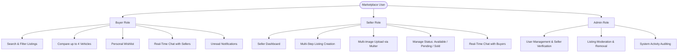
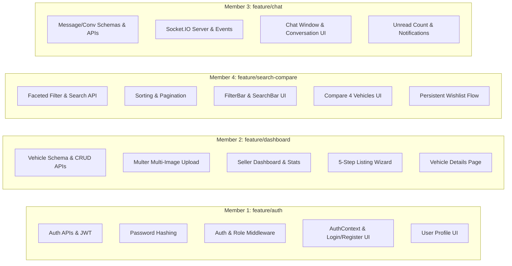
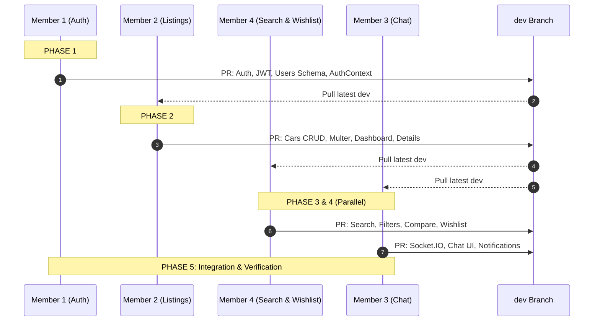

# 🚗 Vehicle-Hub (AutoHub) — Master Implementation & Task Plan

> **University Team Project Implementation Guide & Task Allocation Document**  
> **Project Version**: 1.0.0  
> **Target Architecture**: Next.js 14+ (App Router) + Node.js/Express + JSON Storage + Socket.IO  
> **Collaboration Model**: 4 Team Members on dedicated Git Feature Branches

---

## 1. Project Overview

**Vehicle-Hub (AutoHub)** is a lightweight, responsive, full-stack vehicle marketplace web application designed for buying, selling, comparing, and discussing vehicles in real-time. Built for a collaborative university software engineering project, it emphasizes modularity, zero-database overhead (using structured JSON file storage with atomic `fs/promises`), clean REST APIs, robust JWT authentication, role-based access control, and real-time Socket.IO communication.

### 1.1 Target Users & Core Capabilities



### 1.2 Core Architectural Principles
1. **Zero External Database Requirement**: All persistence uses JSON flat-files (`server/data/*.json`) managed via asynchronous `fs/promises` utility wrappers with concurrency protection.
2. **Strict Separation of Concerns**: Client and Server are decoupled. Client operates on Next.js 14+ App Router (`client/`), while Server runs on Express.js with REST endpoints and WebSocket events (`server/`).
3. **Role-Based Security**: Strict JWT verification, password hashing with bcrypt, role authorization (`buyer`, `seller`, `admin`), and resource ownership enforcement (`req.user.id === car.sellerId`).
4. **Branch Isolation**: 4 dedicated Git feature branches (`feature/auth`, `feature/dashboard`, `feature/chat`, `feature/search-compare`) merging into `dev` via Pull Requests.

---

## 2. Technology Stack

| Layer | Technology | Version | Purpose |
| :--- | :--- | :--- | :--- |
| **Frontend Framework** | Next.js (App Router) | `14+` | Page routing, server/client components, layout orchestration |
| **Frontend Library** | React | `18+` | Reactive UI, hooks, context state management |
| **Styling** | Tailwind CSS | `3+` | Modern responsive utility styling, dark/light modes |
| **Icons** | Lucide React | Latest | Modern, lightweight iconography |
| **HTTP Client** | Axios / Native Fetch | Latest | REST API integration with auth interceptors |
| **Backend Runtime** | Node.js | `18+ LTS` | Server-side execution environment |
| **Backend Framework**| Express.js | `4.18+` | REST API routes, middleware pipeline |
| **Authentication** | JSON Web Tokens (`jsonwebtoken`) + `bcryptjs` | Latest | Stateless auth, secure password hashing |
| **Real-Time WebSockets**| Socket.IO (`socket.io` & `socket.io-client`)| `4.7+` | Instant messaging, typing indicators, live notifications |
| **File Uploads** | Multer | `1.4+` | Multi-image multipart upload, validation, disk storage |
| **Data Persistence** | Native Node.js `fs/promises` | Built-in | Structured JSON flat-file storage |
| **Backend Testing** | Jest + Supertest | `29+` | Unit testing, REST API integration test suite |
| **Frontend Testing** | React Testing Library + Jest | Latest | Component rendering, user event verification |

---

## 3. Repository Directory Structure

```text
Vehicle-Hub/
├── client/                               # Next.js 14+ Frontend Application
│   ├── app/                              # Next.js App Router
│   │   ├── (auth)/                       # Authentication Route Group
│   │   │   ├── login/
│   │   │   │   └── page.jsx              # Login Page
│   │   │   └── register/
│   │   │       └── page.jsx              # Registration Page
│   │   ├── profile/
│   │   │   └── page.jsx                  # User Profile & Password Change
│   │   ├── cars/
│   │   │   ├── page.jsx                  # Vehicle Catalog & Search/Filters
│   │   │   ├── [id]/
│   │   │   │   └── page.jsx              # Vehicle Details Page
│   │   │   └── compare/
│   │   │       └── page.jsx              # Vehicle Side-by-Side Comparison
│   │   ├── seller/
│   │   │   ├── dashboard/
│   │   │   │   └── page.jsx              # Seller Overview & Listing Table
│   │   │   └── create-listing/
│   │   │       └── page.jsx              # 5-Step Listing Creation Wizard
│   │   ├── wishlist/
│   │   │   └── page.jsx                  # Buyer Wishlist Page
│   │   ├── messages/
│   │   │   └── page.jsx                  # Real-Time Chat & Conversations
│   │   ├── admin/
│   │   │   └── page.jsx                  # Admin Management & Moderation
│   │   ├── layout.jsx                    # Root Layout with Nav & Auth Provider
│   │   ├── page.jsx                      # Homepage / Hero / Featured Cars
│   │   └── globals.css                   # Tailwind Global Directives
│   ├── components/                       # Modular UI Components
│   │   ├── auth/                         # ProtectedRoute, AuthForm
│   │   ├── cars/                         # CarCard, CarGrid, ImageGallery
│   │   ├── chat/                         # ChatWindow, ConversationList, MessageBubble
│   │   ├── common/                       # Navbar, Footer, Modal, Loader, Badge
│   │   ├── dashboard/                    # StatCard, ListingTable, StatusBadge
│   │   └── search/                       # FilterBar, SearchBar, SortDropdown, Pagination
│   ├── context/                          # Global React State Providers
│   │   ├── AuthContext.jsx               # Auth state, token, user, login/logout
│   │   ├── ChatContext.jsx               # Socket instance, unread count, live messages
│   │   └── WishlistContext.jsx           # Local/server synced wishlist state
│   ├── hooks/                            # Custom React Hooks (useAuth, useSocket, etc.)
│   ├── services/                         # API Client & Axios Interceptors
│   │   ├── api.js                        # Base Axios instance with JWT interceptor
│   │   ├── authService.js
│   │   ├── carService.js
│   │   ├── chatService.js
│   │   └── wishlistService.js
│   ├── public/                           # Static assets, mock images, logos
│   ├── package.json
│   ├── tailwind.config.js
│   └── next.config.js
│
├── server/                               # Node.js + Express REST API & Socket.IO
│   ├── controllers/                      # Request Handlers & Business Logic
│   │   ├── authController.js             # Register, login, me, updateProfile
│   │   ├── carController.js              # CRUD, search, filter, upload, status
│   │   ├── messageController.js          # Conversations, message history, read receipt
│   │   ├── wishlistController.js         # Add, remove, list user wishlist
│   │   └── adminController.js            # User management, verify seller, moderate
│   ├── middleware/                       # Custom Express Middlewares
│   │   ├── authMiddleware.js             # JWT verification (authenticateToken)
│   │   ├── roleMiddleware.js             # Role check (requireRole('seller'|'admin'))
│   │   ├── uploadMiddleware.js           # Multer configuration & file filter
│   │   └── errorMiddleware.js            # Global error handler
│   ├── routes/                           # Express Route Definitions
│   │   ├── authRoutes.js                 # /api/auth
│   │   ├── userRoutes.js                 # /api/users
│   │   ├── carRoutes.js                  # /api/cars
│   │   ├── messageRoutes.js              # /api/messages
│   │   └── adminRoutes.js                # /api/admin
│   ├── sockets/                          # Socket.IO Handlers
│   │   └── chatSocket.js                 # Connection, join, sendMessage, typing, read
│   ├── services/                         # Data Access & File Operations
│   │   └── jsonStorage.js                # Reusable async JSON read/write helper
│   ├── data/                             # JSON Flat-File Database
│   │   ├── users.json                    # User credentials, roles, wishlist
│   │   ├── cars.json                     # Vehicle listings, specs, images, status
│   │   ├── messages.json                 # Chat messages & timestamps
│   │   ├── conversations.json            # Active conversation metadata
│   │   └── notifications.json           # User alert records
│   ├── uploads/                          # Uploaded Vehicle Images (served statically)
│   ├── tests/                            # Automated Backend Test Suites
│   │   ├── auth.test.js
│   │   ├── cars.test.js
│   │   ├── search.test.js
│   │   ├── wishlist.test.js
│   │   └── messages.test.js
│   ├── .env.example                      # Sample server environment variables
│   ├── server.js                         # Express App & HTTP/Socket Server Entrypoint
│   └── package.json
│
├── .gitignore
├── LICENSE
├── README.md                             # Project Documentation
└── TASK.md                               # Master Implementation Specification
```

---

## 4. Data Models & JSON Schemas

### 4.1 User Schema (`server/data/users.json`)
```json
{
  "id": "user-1719800000000-1234",
  "name": "Jane Doe",
  "email": "jane@example.com",
  "passwordHash": "$2a$10$abcdefghijklmnopqrstuvwxyz1234567890...",
  "phone": "+94771234567",
  "address": "123 Galle Road, Colombo 03",
  "role": "seller",
  "verifiedSeller": true,
  "wishlist": ["car-1719800000000-001", "car-1719800000000-004"],
  "createdAt": "2026-03-01T10:00:00.000Z",
  "updatedAt": "2026-03-02T12:30:00.000Z"
}
```
* **Allowed Roles**: `"buyer"`, `"seller"`, `"admin"`
* **Security Rule**: `passwordHash` must NEVER be returned in any API response.

### 4.2 Vehicle Schema (`server/data/cars.json`)
```json
{
  "id": "car-1719800000000-001",
  "sellerId": "user-1719800000000-1234",
  "title": "Toyota Aqua S Grade 2018",
  "make": "Toyota",
  "model": "Aqua",
  "year": 2018,
  "price": 6250000,
  "mileage": 65000,
  "fuelType": "Hybrid",
  "transmission": "Automatic",
  "condition": "Used",
  "location": "Colombo",
  "description": "Mint condition, 1st owner, company maintained with complete service records.",
  "images": [
    "/uploads/car-1719800000001-front.jpg",
    "/uploads/car-1719800000002-side.jpg",
    "/uploads/car-1719800000003-interior.jpg"
  ],
  "status": "Available",
  "createdAt": "2026-03-01T11:00:00.000Z",
  "updatedAt": "2026-03-01T11:00:00.000Z"
}
```
* **Allowed Statuses**: `"Available"`, `"Pending"`, `"Sold"`
* **Allowed Fuel Types**: `"Petrol"`, `"Diesel"`, `"Hybrid"`, `"Electric"`
* **Allowed Transmissions**: `"Automatic"`, `"Manual"`
* **Allowed Conditions**: `"Brand New"`, `"Used"`, `"Reconditioned"`

### 4.3 Message Schema (`server/data/messages.json`)
```json
{
  "id": "msg-1719800000000-5678",
  "conversationId": "conv-1719800000000-9999",
  "senderId": "user-1719800000000-5555",
  "receiverId": "user-1719800000000-1234",
  "carId": "car-1719800000000-001",
  "message": "Hello, is the price negotiable for immediate purchase?",
  "read": false,
  "createdAt": "2026-03-02T14:20:00.000Z"
}
```

### 4.4 Conversation Schema (`server/data/conversations.json`)
```json
{
  "id": "conv-1719800000000-9999",
  "carId": "car-1719800000000-001",
  "buyerId": "user-1719800000000-5555",
  "sellerId": "user-1719800000000-1234",
  "lastMessage": "Hello, is the price negotiable for immediate purchase?",
  "lastMessageAt": "2026-03-02T14:20:00.000Z",
  "createdAt": "2026-03-02T14:20:00.000Z"
}
```

### 4.5 Notification Schema (`server/data/notifications.json`)
```json
{
  "id": "notif-1719800000000-1111",
  "userId": "user-1719800000000-1234",
  "title": "New Message",
  "message": "You received a new message regarding Toyota Aqua 2018",
  "type": "chat",
  "read": false,
  "referenceId": "conv-1719800000000-9999",
  "createdAt": "2026-03-02T14:20:00.000Z"
}
```

---

## 5. Complete REST API Specification

### 5.1 Authentication & Profile APIs (`Member 1`)

| Method | Endpoint | Auth Required | Allowed Roles | Request Body | Response Codes | Description |
| :--- | :--- | :---: | :--- | :--- | :--- | :--- |
| `POST` | `/api/auth/register` | No | Public | `{ name, email, password, phone, address, role }` | `201`, `400`, `409` | Register a new user (`buyer`/`seller`) |
| `POST` | `/api/auth/login` | No | Public | `{ email, password }` | `200`, `400`, `401` | Authenticate user & return JWT + user |
| `GET` | `/api/users/me` | **Yes** | Any (`buyer`,`seller`,`admin`) | *None* | `200`, `401`, `404` | Get authenticated user profile |
| `PUT` | `/api/users/me` | **Yes** | Any | `{ name, phone, address }` | `200`, `400`, `401` | Update profile information |
| `PUT` | `/api/users/me/password`| **Yes** | Any | `{ currentPassword, newPassword }` | `200`, `400`, `401` | Secure password change |

### 5.2 Vehicle Listing & Seller APIs (`Member 2`)

| Method | Endpoint | Auth Required | Allowed Roles | Request Body / Multipart | Response Codes | Description |
| :--- | :--- | :---: | :--- | :--- | :--- | :--- |
| `GET` | `/api/cars` | No | Public | Query: `?status=Available&page=1...` | `200`, `500` | List vehicles with filters & pagination |
| `GET` | `/api/cars/:id` | No | Public | *None* | `200`, `404` | Get single vehicle details + seller info |
| `POST` | `/api/cars` | **Yes** | `seller`, `admin` | Multipart Form: Car fields + `images` | `201`, `400`, `401`, `403` | Create new listing with uploaded images |
| `PUT` | `/api/cars/:id` | **Yes** | `seller` (owner), `admin` | JSON / Multipart: Updated car fields | `200`, `400`, `403`, `404` | Update vehicle (enforces seller ownership) |
| `PATCH`| `/api/cars/:id/status` | **Yes** | `seller` (owner), `admin`| `{ status: "Available"\|"Pending"\|"Sold" }` | `200`, `400`, `403`, `404` | Change listing status |
| `DELETE`| `/api/cars/:id` | **Yes** | `seller` (owner), `admin`| *None* | `200`, `403`, `404` | Delete listing & remove orphaned images |
| `GET` | `/api/cars/seller/my-listings`| **Yes** | `seller`, `admin` | *None* | `200`, `401`, `403` | Get all listings created by current seller |

### 5.3 Search, Filtering, Comparison & Wishlist APIs (`Member 4`)

| Method | Endpoint | Auth Required | Allowed Roles | Request Query / Body | Response Codes | Description |
| :--- | :--- | :---: | :--- | :--- | :--- | :--- |
| `GET` | `/api/cars` | No | Public | `keyword, minPrice, maxPrice, minYear, maxYear, minMileage, maxMileage, fuelType, transmission, make, model, location, status, sort, page, limit` | `200`, `400` | Multi-facet filter, keyword search, sorting & pagination |
| `GET` | `/api/cars/compare` | No | Public | Query: `?ids=car-1,car-2,car-3,car-4` | `200`, `400` | Fetch detailed specs of 2 to 4 vehicles |
| `GET` | `/api/users/me/wishlist` | **Yes** | Any | *None* | `200`, `401` | Retrieve populated wishlist cars for user |
| `POST` | `/api/users/me/wishlist/:carId` | **Yes** | Any | *None* | `200`, `400`, `404` | Add car to user's persistent wishlist |
| `DELETE`| `/api/users/me/wishlist/:carId`| **Yes** | Any | *None* | `200`, `400`, `404` | Remove car from user's wishlist |

### 5.4 Real-Time Messaging & Notification APIs (`Member 3`)

| Method | Endpoint | Auth Required | Allowed Roles | Request Body | Response Codes | Description |
| :--- | :--- | :---: | :--- | :--- | :--- | :--- |
| `GET` | `/api/messages/conversations` | **Yes** | Any | *None* | `200`, `401` | Get all conversations involving current user |
| `GET` | `/api/messages/:conversationId` | **Yes** | Any | *None* | `200`, `401`, `403` | Get message history for a conversation |
| `POST` | `/api/messages` | **Yes** | Any | `{ receiverId, carId, message }` | `201`, `400`, `401` | Send a message (creates conv if new) |
| `PUT` | `/api/messages/:conversationId/read`| **Yes** | Any | *None* | `200`, `401`, `403` | Mark all unread messages as read |
| `GET` | `/api/messages/unread/count` | **Yes** | Any | *None* | `200`, `401` | Get total unread message count for user |
| `GET` | `/api/notifications` | **Yes** | Any | *None* | `200`, `401` | List user notification alerts |

### 5.5 Admin APIs (Shared / Integration)

| Method | Endpoint | Auth Required | Allowed Roles | Request Body | Response Codes | Description |
| :--- | :--- | :---: | :--- | :--- | :--- | :--- |
| `GET` | `/api/admin/users` | **Yes** | `admin` | *None* | `200`, `403` | List all registered users |
| `PATCH`| `/api/admin/users/:id/verify-seller` | **Yes** | `admin` | `{ verifiedSeller: true\|false }` | `200`, `403`, `404` | Grant/Revoke seller verification badge |
| `DELETE`| `/api/admin/cars/:id` | **Yes** | `admin` | *None* | `200`, `403`, `404` | Moderation: force remove car listing |
| `GET` | `/api/admin/stats` | **Yes** | `admin` | *None* | `200`, `403` | Overall marketplace statistics |

---

## 6. Team Responsibilities & Feature Breakdown



---

### MEMBER 1: Authentication & User Profiles
* **Git Branch**: `feature/auth`
* **Lead Responsibility**: Identity lifecycle, password security, session management, route protection, user profile management.
* **Core Deliverables**:
  1. Standardize `server/data/users.json` with secure initial mock data.
  2. Implement `POST /api/auth/register` with duplicate check and bcrypt hashing.
  3. Implement `POST /api/auth/login` returning signed JWT with user metadata.
  4. Create `server/middleware/authMiddleware.js` (`authenticateToken`) and `roleMiddleware.js` (`requireRole`).
  5. Implement profile endpoints: `GET /api/users/me`, `PUT /api/users/me`, `PUT /api/users/me/password`.
  6. Build frontend `client/context/AuthContext.jsx` with persistent token storage (`localStorage` / cookies).
  7. Build client pages: `/login`, `/register`, `/profile` with validation, toast notifications, loading states.
* **Acceptance Criteria**:
  - [x] Unauthenticated requests to protected endpoints return `401 Unauthorized`.
  - [x] Invalid roles return `403 Forbidden`.
  - [x] Plaintext passwords are never stored or returned in any JSON response.
  - [x] Password changes require valid current password.
  - [x] Login and registration persist auth token across page reloads.

---

### MEMBER 2: Seller Dashboard & Listing Management
* **Git Branch**: `feature/dashboard`
* **Lead Responsibility**: Vehicle inventory management, multi-step creation wizard, image upload pipeline, seller dashboard.
* **Dependencies**: Consumes Member 1's `authenticateToken` and `requireRole("seller")`.
* **Core Deliverables**:
  1. Standardize `server/data/cars.json` with full specification fields.
  2. Configure `server/middleware/uploadMiddleware.js` using Multer to validate and store files in `server/uploads/`.
  3. Serve `server/uploads/` statically via Express (`app.use('/uploads', express.static(...))`).
  4. Implement Vehicle CRUD: `GET /api/cars`, `GET /api/cars/:id`, `POST /api/cars`, `PUT /api/cars/:id`, `PATCH /api/cars/:id/status`, `DELETE /api/cars/:id`.
  5. Enforce ownership: sellers cannot modify or delete vehicles owned by other sellers.
  6. Build `client/app/seller/dashboard/page.jsx` with metrics (Total, Available, Pending, Sold) and listing management table.
  7. Build 5-step listing creation wizard (`client/app/seller/create-listing/page.jsx`):
     - Step 1: Basic Information (Make, Model, Year, Condition)
     - Step 2: Technical Specifications (Mileage, Fuel, Transmission)
     - Step 3: Pricing & Location (Price, Location, Description)
     - Step 4: Multi-Image Upload (Dropzone, image previews, removal)
     - Step 5: Summary Review & Publish
  8. Build public Vehicle Details page (`client/app/cars/[id]/page.jsx`) with image carousel, full specs, seller info, and CTA buttons (Wishlist, Compare, Contact Seller).
* **Acceptance Criteria**:
  - [x] Sellers can create listings with multiple uploaded images stored in `/uploads`.
  - [x] Sellers can only edit/delete their own listings.
  - [x] Status changes (`Available` -> `Pending` -> `Sold`) reflect immediately in public views.
  - [x] Details page displays accurate specifications and seller badges.

---

### MEMBER 4: Advanced Search, Filters, Comparison & Wishlist
* **Git Branch**: `feature/search-compare`
* **Lead Responsibility**: Discovery UX, faceted search engine, side-by-side vehicle comparison matrix, user wishlist.
* **Dependencies**: Consumes Member 1's `AuthContext` and Member 2's `cars.json` schema.
* **Core Deliverables**:
  1. Enhance `GET /api/cars` controller with multi-parameter filtering, regex/case-insensitive keyword search, sorting (`price_asc`, `price_desc`, `year_newest`, `mileage_low`, `newest`), and pagination metadata (`page`, `limit`, `total`, `totalPages`).
  2. Implement user wishlist APIs: `GET /api/users/me/wishlist`, `POST /api/users/me/wishlist/:carId`, `DELETE /api/users/me/wishlist/:carId`. Prevent duplicates in `users.json`.
  3. Implement `GET /api/cars/compare?ids=id1,id2,id3,id4`.
  4. Build discovery interface (`client/app/cars/page.jsx`) with:
     - `SearchBar` (live search with debouncing)
     - `FilterBar` (Make, Model, Price Range Slider, Year Range, Fuel, Transmission, Condition)
     - `SortDropdown` and `Pagination` controls
  5. Build Wishlist UI (`client/app/wishlist/page.jsx`) displaying saved cards with quick actions.
  6. Build Comparison View (`client/app/cars/compare/page.jsx`) rendering a side-by-side comparison table for up to 4 vehicles with spec diff highlighting.
* **Acceptance Criteria**:
  - [x] Keyword search scans title, description, make, model, and location case-insensitively.
  - [x] Combining multiple filters yields exact matches with correct pagination counts.
  - [x] Comparison rejects adding more than 4 vehicles and alerts the user gracefully.
  - [x] Wishlist persists across login sessions and is synced with `users.json`.

---

### MEMBER 3: Real-Time Messaging & Notifications
* **Git Branch**: `feature/chat`
* **Lead Responsibility**: Instant messaging infrastructure, WebSocket event handling, message persistence, unread notification badges.
* **Dependencies**: Consumes Member 1's `authenticateToken` / user context and Member 2's `cars.json` vehicle IDs.
* **Core Deliverables**:
  1. Standardize `server/data/messages.json`, `conversations.json`, and `notifications.json`.
  2. Setup Socket.IO server in `server/server.js` and `server/sockets/chatSocket.js`.
  3. Implement Socket events:
     - `connection`: Map active user socket IDs.
     - `joinConversation`: Join room scoped to `conversationId`.
     - `sendMessage`: Save message to `messages.json`, update `conversations.json`, emit `receiveMessage` to recipient.
     - `typing` / `stopTyping`: Broadcast live typing status.
     - `markRead`: Update `read: true` and notify sender with read receipt.
  4. Implement REST fallback & history APIs (`/api/messages/conversations`, `/api/messages/:conversationId`, `/api/messages/unread/count`).
  5. Build `client/context/ChatContext.jsx` handling socket connection lifecycle and global unread counter.
  6. Build full Chat UI (`client/app/messages/page.jsx`):
     - Left pane: Conversation list with vehicle thumbnail, partner name, last message preview, unread badge.
     - Right pane: Active chat header (car info, partner info), message bubble stream with timestamps, typing indicator, send input.
  7. Add "Contact Seller" modal/button on Vehicle Details page that auto-initializes the conversation.
* **Acceptance Criteria**:
  - [x] Real-time message delivery without page refresh when both users are online.
  - [x] Messages persist in `messages.json` and load on subsequent page visits.
  - [x] Unread badge (`🔔 count`) increments in real time on the Navbar when new messages arrive.
  - [x] Users can only access conversations where they are either the buyer or seller.

---

## 7. Dependencies & Team Integration Flow



### 7.1 Cross-Member Contract Interfaces

1. **Member 1 -> Member 2 & 3 & 4**:
   - `req.user` payload: `{ id: string, email: string, role: "buyer"|"seller"|"admin", name: string }`
   - Express middleware: `authenticateToken(req, res, next)` and `requireRole(role)`
   - Frontend: `useAuth()` hook providing `{ user, token, login, register, logout, isAuthenticated }`
2. **Member 2 -> Member 4 & 3**:
   - `cars.json` structure with fields: `id`, `sellerId`, `title`, `make`, `model`, `year`, `price`, `mileage`, `fuelType`, `transmission`, `condition`, `location`, `images`, `status`
   - Image URL format: `/uploads/<filename>`
3. **Member 4 -> Member 1**:
   - Updates `user.wishlist` array of car ID strings in `users.json`.
4. **Member 3 -> Member 1 & 2**:
   - Creates conversations linked to `buyerId`, `sellerId`, and `carId`.

---

## 8. Implementation Checklist & Progress Tracker

### Legend
- `[ ]` Not Started
- `[/]` In Progress
- `[x]` Implemented & Tested

---

### Phase 0: Project Setup & Common Infrastructure
- [ ] Initialize frontend Next.js 14 project in `client/`
- [ ] Initialize Express.js backend in `server/`
- [ ] Create `server/services/jsonStorage.js` utility for thread-safe JSON I/O
- [ ] Seed initial mock files: `users.json`, `cars.json`, `messages.json`, `conversations.json`, `notifications.json`
- [ ] Create `server/uploads/` directory with sample vehicle images
- [ ] Setup unified `.gitignore` and `.env.example`
- [ ] Configure Tailwind CSS & global layout in `client/`
- [ ] Setup Jest & Supertest test configurations

---

### Phase 1: Authentication & User Profiles (Member 1)
- [ ] **Backend**: Standardize User Schema in `server/data/users.json`
- [ ] **Backend**: Implement bcrypt password hashing helper
- [ ] **Backend**: Implement `POST /api/auth/register` (validation, duplicate checks)
- [ ] **Backend**: Implement `POST /api/auth/login` (JWT token generation)
- [ ] **Backend**: Implement `authenticateToken` middleware in `server/middleware/authMiddleware.js`
- [ ] **Backend**: Implement `requireRole` middleware in `server/middleware/roleMiddleware.js`
- [ ] **Backend**: Implement `GET /api/users/me` & `PUT /api/users/me` (profile editing)
- [ ] **Backend**: Implement `PUT /api/users/me/password` (password change with current password check)
- [ ] **Frontend**: Create `client/services/authService.js` and Axios base client with token interceptor
- [ ] **Frontend**: Create `client/context/AuthContext.jsx`
- [ ] **Frontend**: Build Login Page (`client/app/(auth)/login/page.jsx`)
- [ ] **Frontend**: Build Register Page (`client/app/(auth)/register/page.jsx`) with Buyer/Seller selection
- [ ] **Frontend**: Build Profile Page (`client/app/profile/page.jsx`) with edit info & change password forms
- [ ] **Frontend**: Build Protected Route wrapper component
- [ ] **Testing**: Write unit & integration tests in `server/tests/auth.test.js`

---

### Phase 2: Seller Dashboard & Listing Management (Member 2)
- [ ] **Backend**: Standardize Vehicle Schema in `server/data/cars.json`
- [ ] **Backend**: Setup Multer upload storage and MIME-type validation in `server/middleware/uploadMiddleware.js`
- [ ] **Backend**: Serve `/uploads` static route in `server/server.js`
- [ ] **Backend**: Implement `GET /api/cars` and `GET /api/cars/:id`
- [ ] **Backend**: Implement `POST /api/cars` (multipart upload + listing creation)
- [ ] **Backend**: Implement `PUT /api/cars/:id` and `DELETE /api/cars/:id` (seller ownership verification)
- [ ] **Backend**: Implement `PATCH /api/cars/:id/status` (Available, Pending, Sold)
- [ ] **Backend**: Implement `GET /api/cars/seller/my-listings`
- [ ] **Frontend**: Create `client/services/carService.js`
- [ ] **Frontend**: Build Seller Dashboard (`client/app/seller/dashboard/page.jsx`) with stats cards & listings table
- [ ] **Frontend**: Build 5-step Listing Creation Wizard (`client/app/seller/create-listing/page.jsx`) with image drag & drop
- [ ] **Frontend**: Build Edit Listing modal/page with status toggle
- [ ] **Frontend**: Build Vehicle Details page (`client/app/cars/[id]/page.jsx`) with image carousel & specs
- [ ] **Testing**: Write vehicle CRUD & upload tests in `server/tests/cars.test.js`

---

### Phase 3: Advanced Search, Filters, Comparison & Wishlist (Member 4)
- [ ] **Backend**: Enhance `GET /api/cars` with query filtering (make, model, year, price, mileage, fuel, transmission, condition)
- [ ] **Backend**: Add regex/case-insensitive keyword search (title, description, location)
- [ ] **Backend**: Add multi-criteria sorting and pagination response metadata
- [ ] **Backend**: Implement `GET /api/users/me/wishlist`, `POST /api/users/me/wishlist/:carId`, `DELETE /api/users/me/wishlist/:carId`
- [ ] **Backend**: Implement `GET /api/cars/compare?ids=...` (max 4 vehicles)
- [ ] **Frontend**: Create `client/services/wishlistService.js` and `client/context/WishlistContext.jsx`
- [ ] **Frontend**: Build `FilterBar`, `SearchBar`, `SortDropdown`, and `Pagination` components
- [ ] **Frontend**: Build Marketplace Catalog Page (`client/app/cars/page.jsx`)
- [ ] **Frontend**: Build Wishlist Page (`client/app/wishlist/page.jsx`)
- [ ] **Frontend**: Build Vehicle Comparison Page (`client/app/cars/compare/page.jsx`) with 4-vehicle limit
- [ ] **Testing**: Write search, filter, and wishlist tests in `server/tests/search.test.js` & `server/tests/wishlist.test.js`

---

### Phase 4: Real-Time Messaging & Notifications (Member 3)
- [ ] **Backend**: Standardize `messages.json`, `conversations.json`, `notifications.json`
- [ ] **Backend**: Initialize Socket.IO server in `server/server.js`
- [ ] **Backend**: Implement WebSocket handlers (`joinConversation`, `sendMessage`, `typing`, `markRead`) in `server/sockets/chatSocket.js`
- [ ] **Backend**: Implement REST endpoints: `GET /api/messages/conversations`, `GET /api/messages/:conversationId`, `POST /api/messages`, `PUT /api/messages/:id/read`, `GET /api/messages/unread/count`
- [ ] **Frontend**: Create `client/services/chatService.js` and `client/context/ChatContext.jsx`
- [ ] **Frontend**: Build Chat UI (`client/app/messages/page.jsx`) with conversation sidebar & message stream
- [ ] **Frontend**: Build Live Typing Indicator and Read Receipt components
- [ ] **Frontend**: Build Navbar Notification Badge (`🔔 count`)
- [ ] **Frontend**: Wire "Contact Seller" button on `client/app/cars/[id]/page.jsx` to initiate chat
- [ ] **Testing**: Write messaging & socket tests in `server/tests/messages.test.js`

---

### Phase 5: Admin Functionality & System Integration
- [ ] **Backend**: Implement Admin routes in `server/routes/adminRoutes.js` (`/api/admin/users`, `/api/admin/users/:id/verify-seller`, `/api/admin/cars/:id`)
- [ ] **Frontend**: Build Admin Dashboard (`client/app/admin/page.jsx`)
- [ ] **Integration**: Execute end-to-end multi-account buyer/seller/admin test flow
- [ ] **Polish**: UI responsiveness, dark/light theme consistency, loading skeletons, error boundaries
- [ ] **Documentation**: Ensure `README.md` and `TASK.md` reflect final verified state

---

## 9. Git Workflow & Collaboration Protocols

### 9.1 Branch Topology

```text
main (Production Ready / Release)
  ▲
  │ (Pull Request after milestone integration)
dev (Main Integration Branch)
  ▲
  ├── feature/auth           (Member 1)
  ├── feature/dashboard      (Member 2)
  ├── feature/chat           (Member 3)
  └── feature/search-compare (Member 4)
```

### 9.2 Step-by-Step Feature Workflow

1. **Daily Sync with `dev`**:
   ```bash
   git checkout dev
   git pull origin dev
   ```
2. **Create / Switch to Feature Branch**:
   ```bash
   git checkout -b feature/auth # (or switch: git checkout feature/auth)
   git merge dev               # Ensure you have the latest integrated changes
   ```
3. **Commit Incrementally with Conventional Commits**:
   ```bash
   git add <modified-files>
   git commit -m "feat(auth): implement bcrypt password hashing and user registration"
   ```
4. **Push & Create Pull Request**:
   ```bash
   git push origin feature/auth
   ```
   Open a PR from `feature/<name>` into `dev`. Require at least 1 peer code review before merging.

### 9.3 Commit Message Convention
* `feat(<scope>)`: A new feature (e.g., `feat(cars): add 5-step listing creation wizard`)
* `fix(<scope>)`: A bug fix (e.g., `fix(auth): prevent duplicate email registration`)
* `refactor(<scope>)`: Code change that neither fixes a bug nor adds a feature
* `test(<scope>)`: Adding or refactoring tests
* `docs(<scope>)`: Documentation updates (e.g., `docs: update API endpoints in TASK.md`)
* `chore(<scope>)`: Dependency updates, tooling, configuration

---

## 10. Automated & Manual Testing Plan

### 10.1 Backend API Test Suites (Jest + Supertest)

```bash
cd server
npm test
```

| Test Suite | File | Key Test Cases Covered |
| :--- | :--- | :--- |
| **Auth Suite** | `server/tests/auth.test.js` | User registration, duplicate rejection, password hashing verification, JWT issue on valid login, rejection of invalid password, token expiry handling. |
| **Cars Suite** | `server/tests/cars.test.js` | Public vehicle retrieval, seller listing creation, multi-image upload validation, rejection of non-seller listing attempts, seller ownership enforcement on update/delete. |
| **Search Suite** | `server/tests/search.test.js`| Keyword search on title/desc/make, combined range filters (price, year, mileage), sorting logic correctness, pagination calculations. |
| **Wishlist Suite**| `server/tests/wishlist.test.js`| Adding car to wishlist, duplicate addition prevention, removing car from wishlist, fetching populated user wishlist. |
| **Chat Suite** | `server/tests/messages.test.js`| Conversation creation, message sending, message retrieval by authorized participants, rejection of unauthorized access, unread count accuracy. |

---

## 11. End-to-End Multi-Account Verification Matrix

To certify completion of the project, execute the following verified test protocol with three distinct simulated user accounts:

```text
Seller Account:  seller@autohub.com  / Password123!
Buyer Account:   buyer@autohub.com   / Password123!
Admin Account:   admin@autohub.com   / AdminPass123!
```

### Verification Script

| Step | Persona | Action | Expected Outcome | Status |
| :---: | :---: | :--- | :--- | :---: |
| **1** | **Seller** | Register account with role `seller` | Account created, redirected to Login, `users.json` updated with hashed password | `[ ]` |
| **2** | **Seller** | Login with credentials | JWT stored in auth state, redirected to `/seller/dashboard` | `[ ]` |
| **3** | **Seller** | Complete 5-Step Listing Wizard with 3 uploaded images | Vehicle saved to `cars.json`, images in `/uploads`, status `Available` | `[ ]` |
| **4** | **Buyer** | Register account with role `buyer` & log in | Account created, authenticated session active | `[ ]` |
| **5** | **Buyer** | Search vehicle by keyword and filter by price range | Newly created vehicle appears in search results with correct pagination | `[ ]` |
| **6** | **Buyer** | Open vehicle details page (`/cars/:id`) | Image gallery, full specifications, and seller contact details render | `[ ]` |
| **7** | **Buyer** | Click "Add to Wishlist" | Wishlist badge increments, vehicle ID saved to buyer's `wishlist` array | `[ ]` |
| **8** | **Buyer** | Add vehicle to Comparison (along with 2 others) | `/cars/compare` displays side-by-side spec comparison table | `[ ]` |
| **9** | **Buyer** | Click "Contact Seller" & send a real-time message | Message persists in `messages.json`, Socket event emitted | `[ ]` |
| **10**| **Seller** | Observe seller browser window | Instant notification badge appears (`🔔 1`), message appears in `/messages` | `[ ]` |
| **11**| **Seller** | Reply to buyer in real-time chat | Buyer receives reply instantly without page refresh; unread count updates | `[ ]` |
| **12**| **Seller** | Change listing status to `Sold` from Seller Dashboard | Listing status updates in `cars.json`, displays `Sold` badge in marketplace | `[ ]` |
| **13**| **Admin** | Log in as Administrator | Admin dashboard displays all users and listings; can verify seller or moderate | `[ ]` |

---

*This document serves as the single source of truth for architecture, API schemas, and task delegation for the Vehicle-Hub project.*
